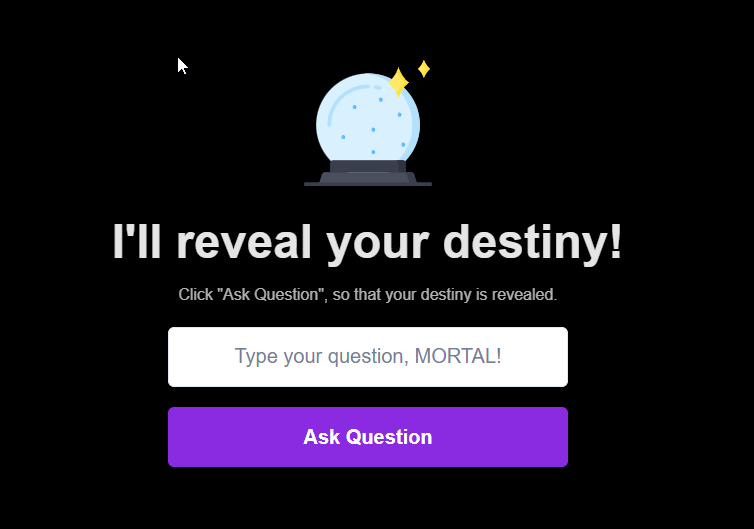

### Crystal Ball Img:

https://gist.githubusercontent.com/maykbrito/0acdf4ce919838ffed50915a31fc5b23/raw/6f4dd01ec3116428ec4c99255944cb9ac7927590/cristal-ball.svg

# Explorer Marathon - RocketSeat

This is a solution to the [Maratona Explorer on RocketSeat](https://www.rocketseat.com.br/).

## Table of contents

- [Overview](#overview)
  - [The challenge](#the-challenge)
  - [Screenshot](#screenshot)
  - [Links](#links)
- [My process](#my-process)
  - [Built with](#built-with)
- [Author](#author)

## Overview

### The challenge

Users should be able to:

- View the optimal layout depending on their device's screen size
- See hover states for interactive elements

### Screenshot

### Links

- Live Site URL: [Site URL here](https://explorer-marathon.vercel.app/)

## My process

### Built with

- [TypeScript](https://www.typescriptlang.org/) - Typed JS
- [React](https://reactjs.org/) - JS library
- [Next.js](https://nextjs.org/) - React framework
- [Chakra UI](https://chakra-ui.com/) - Component Library/For styles

## Author

- GitHub - [Valmar31](https://github.com/Valmar31)
- LinkedIn - [Valmar Munhoz](https://www.linkedin.com/in/valmar-munhoz/)
